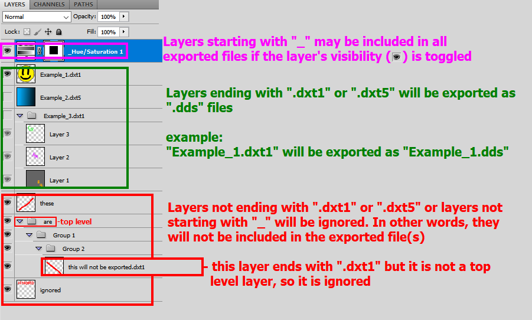
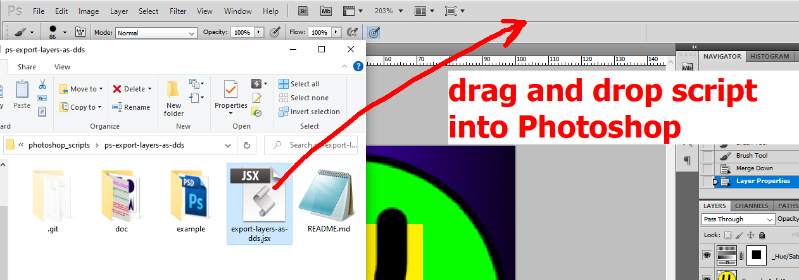
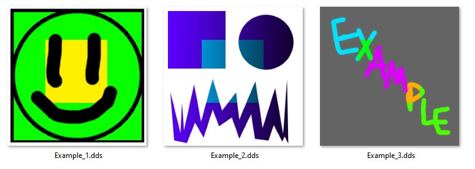

# Requirements

* Photoshop CS5
* NVIDIA Texture Tools Exporter Photoshop plug-in v8.55.0109.1800

other versions of Photoshop and the NVIDIA plug-in may work, but these are the ones I used.

# Setup

Open `example.psd` in Photoshop and observe the layers and their names.

* All layers with names ending with either `.dxt1` or `.dxt5` will be exported as a `.dds` file, and it will be exported in the same directory as the `.psd` file. The name of the file will be named after the layer.
* Layers with names starting with `_` may be included in the exported `.dds` file(s) if they are visible.
* These rules only apply to the top level layers.

Once this is set up, run `export-layers-as-dds.jsx`. You can do this by dragging and dropping the file into the top of Photoshop.

The resulting files exported:

